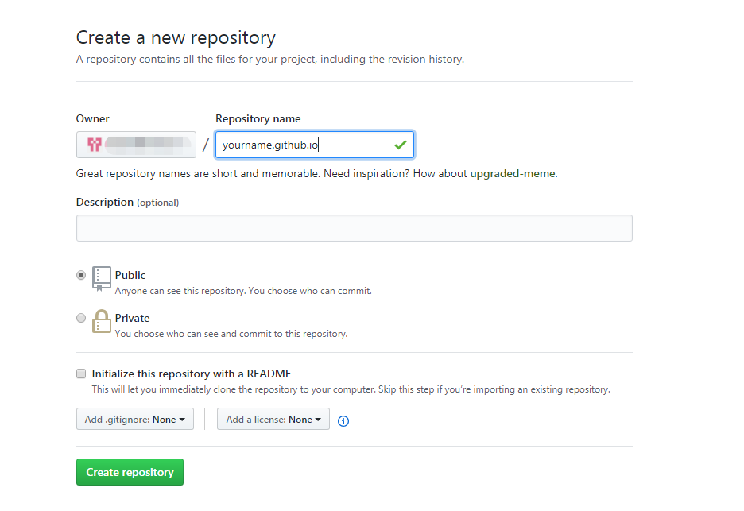

## 步骤
1. 安装hexo的搭建环境
2. 有github帐号并且新建一个仓库
3. 部署hexo到github 
-------
## 安装
```bash
    $ npm install -g hexo-cli
```
## 新建博客
```bash
    $ hexo init blog
    $ cd blog
    $ npm install
```
## 启动服务
```bash
    $ hexo server
```
成功后打开`http://localhost:4000`可以看见博客了
## github新建仓库

新建成功后输入`https://yourname.github.io`是能访问并且看到效果的
## 安装 hexo-deployer-git
```bash
npm install hexo-deployer-git --save
```
## 修改`_config.yml`配置
```bash
deploy:
    type: git
    repo: 你的仓库地址
    branch: master
```
## 生成静态文件
```bash
   $ hexo generate
```
## 部署
```bash
   $ hexo deploy
```
成功后再访问`https://yourname.github.io`发现本地的博客已经同步到了gitHub了


    

