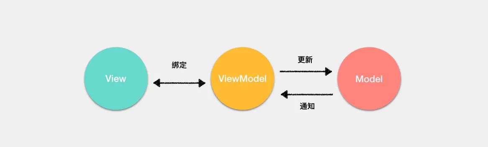

## 什么是防抖和节流

### 防抖

触发高频事件后n秒内函数只会执行一次，如果n秒内高频事件再次被触发，则重新计算时间
```js
function debounce(fn) {
      let timeout = null; // 创建一个标记用来存放定时器的返回值
      return function () {
        clearTimeout(timeout); // 每当用户输入的时候把前一个 setTimeout clear 掉
        timeout = setTimeout(() => { // 然后又创建一个新的 setTimeout, 这样就能保证输入字符后的 interval 间隔内如果还有字符输入的话，就不会执行 fn 函数
          fn.apply(this, arguments);
        }, 500);
      };
    }
    function sayHi() {
      console.log('防抖成功');
    }

    var inp = document.getElementById('inp');
    inp.addEventListener('input', debounce(sayHi)); // 防抖
```

### 节流

高频事件触发，但在n秒内只会执行一次，所以节流会稀释函数的执行频率
```js
function throttle(fn) {
      let canRun = true; // 通过闭包保存一个标记
      return function () {
        if (!canRun) return; // 在函数开头判断标记是否为true，不为true则return
        canRun = false; // 立即设置为false
        setTimeout(() => { // 将外部传入的函数的执行放在setTimeout中
          fn.apply(this, arguments);
          // 最后在setTimeout执行完毕后再把标记设置为true(关键)表示可以执行下一次循环了。当定时器没有执行的时候标记永远是false，在开头被return掉
          canRun = true;
        }, 500);
      };
    }
    function sayHi(e) {
      console.log(e.target.innerWidth, e.target.innerHeight);
    }
    window.addEventListener('resize', throttle(sayHi));
```
## 深拷贝
```js
const deepClone = obj => {
  if (obj === null) return null;
  let clone = Object.assign({}, obj);
  Object.keys(clone).forEach(
    key =>
      (clone[key] =
        typeof obj[key] === 'object' ? deepClone(obj[key]) : obj[key])
  );
  if (Array.isArray(obj)) {
    clone.length = obj.length;
    return Array.from(clone);
  }
  return clone;
};
// 影响性能
function deepClone(arr){
    return JSON.parse(JSON.stringify(arr))
}
```

## 数组乱序
```js
/**
* 著名的Fisher–Yates shuffle 洗牌算法
*/
const shuffle = ([...arr]) => {
  let m = arr.length;
  while (m) {
    const i = Math.floor(Math.random() * m--);
    [arr[m], arr[i]] = [arr[i], arr[m]];
  }
  return arr;
};
```

## 数组去重
```js
// 1 
Array.from(new Set(arr))
// 2
[...new Set(arr)]
```
## 多维数组展平
```js
const deepFlatten = arr =>
  [].concat(...arr.map(v => (Array.isArray(v) ? deepFlatten(v) : v)));
```

## 数组filter
```js
Array.prototype.filter = function(fn,context){
    if(typeof fn != 'function'){
        throw new TypeError(`${fn} is not a function`)
    }
    let arr = this;
    let reuslt = []
    for(var i = 0;i < arr.length; i++){
        let temp= fn.call(context,arr[i],i,arr);
        if(temp){
            result.push(arr[i]);
        }
    }
    return result
}
```
## 手写call,apply,bind
```js
Function.prototype.myCall = function(context, ...args) {
  // 判断是否是undefined和null
  if (typeof context === 'undefined' || context === null) {
    context = window
  }
  let fnSymbol = Symbol()
  context[fnSymbol] = this
  let fn = context[fnSymbol] (...args)
  delete context[fnSymbol] 
  return fn
}

Function.prototype.myApply = function(context, args) {
  // 判断是否是undefined和null
  if (typeof context === 'undefined' || context === null) {
    context = window
  }
  let fnSymbol = Symbol()
  context[fnSymbol] = this
  let fn = context[fnSymbol] (...args)
  return fn
}

Function.prototype.myBind = function(context) {
// 判断是否是undefined和null
    if (typeof context === "undefined" || context === null) {
    	context = window;
    }
    let self = this;
    return function(...args) {
    	return self.apply(context, args);
    }
}
```

## 实现eventEmitter
```js
class EventEmitter {
    constructor() {
      this.events = {}
    }

    on(name, cb) {
      if (!this.events[name]) {
        this.events[name] = [cb];
      } else {
        this.events[name].push(cb)
      }
    }

    emit(name, ...arg) {
      if (this.events[name]) {
        this.events[name].forEach(fn => {
          fn.call(this, ...arg)
        })
      }
    }

    off(name, cb) {
      if (this.events[name]) {
        this.events[name] = this.events[name].filter(fn => {
          return fn != cb
        })
      }
    }

    once(name, fn) {
      var onlyOnce = () => {
        fn.apply(this, arguments);
        this.off(name, onlyOnce)
      }
      this.on(name, onlyOnce);
      return this;
    }
  }
```

## 实现继承
```js
// ES5
function Parent(name,age){
    this.name = name;
    this.age = age;
}
Parent.prototype.say = function(){
    console.log('I am' + this.name)
}

function Child(name, age, sex){
    Parent.call(this,name,age);
    this.sex = sex;
}

Child.prototype = Object.create(Parent.prototype);
Child.prototype.constructor = Child;
```
```js
// ES6
class Parent {
    constructor(name,age){
        this.name = name;
        this.age = age;
    }
}

class Child extends Parents{
    constructor(name,age,sex){
        super(name,age);
        this.sex = sex; // 必须先调用super，才能使用this
    }
}
```
## 实现instanceof
```js
function myInstanceof(left,right){
    var proto = left.__proto__;
    var protoType = right.prototype;
    while(true){
        if(proto === null){
            return false
        }
        if(proto == protoType){
            return true
        }
        proto = proto.__proto__
    }
}
```

## new的过程
1. 创建一个空的简单 JavaScript 对象（即{}）
2. 链接该对象（即设置该对象的构造函数）到另一个对象 
3. 将步骤1新创建的对象作为 this 的上下文
4. 如果该函数没有返回对象，则返回 this
```js
var child = new Parent()
function newParent(){
    var obj = {}; // 首先创建一个对象
    obj.__proto__ = Parent.prototype; // 然后将该对象的__proto__属性指向构造函数的protoType
    var result = Parent.call(obj) // 执行构造函数的方法，将obj作为this传入
    return typeof(result) == 'object' ?  result : obj
}
```
## lazyMan
```
实现一个LazyMan，可以按照以下方式调用:
LazyMan("Hank")输出:
Hi! This is Hank!
 
LazyMan("Hank").sleep(10).eat("dinner")输出
Hi! This is Hank!
//等待10秒..
Wake up after 10
Eat dinner~
 
LazyMan("Hank").eat("dinner").eat("supper")输出
Hi This is Hank!
Eat dinner~
Eat supper~
 
LazyMan("Hank").sleepFirst(5).eat("supper")输出
//等待5秒
Wake up after 5
Hi This is Hank!
Eat supper
 
以此类推。
```
```js
function _LazyMan(name){
    this.nama = name;
    this.queue = [];
    this.queue.push(() => {
        console.log("Hi! This is " + name + "!");
        this.next();
    })
    setTimeout(()=>{
        this.next()
    },0)
  }
  
  _LazyMan.prototype.eat = function(name){
    this.queue.push(() =>{
        console.log("Eat " + name + "~");
        this.next()
    })
    return this;
  }

  _LazyMan.prototype.next = function(){
    var fn = this.queue.shift();
    fn && fn();
  }

  _LazyMan.prototype.sleep = function(time){
    this.queue.push(() =>{
        setTimeout(() => {
            console.log("Wake up after " + time + "s!");
            this.next()
        },time * 1000)
    })
    return this;
  }

  _LazyMan.prototype.sleepFirst = function(time){
    this.queue.unshift(() =>{
        setTimeout(() => {
            console.log("Wake up after " + time + "s!");
            this.next()
        },time * 1000)
    })
    return this;
  }

  function LazyMan(name){
    return new _LazyMan(name)
  }
```
## 实现jsonp
```js
function jsonp(obj) {
    const {url,data} = obj;
    if (!url) return
    return new Promise((resolve, reject) => {
        const cbFn = `jsonp_${Date.now()}` 
        data.callback = cbFn
        const head = document.querySelector('head')
        const script = document.createElement('script')
        const src = `${url}?${data2Url(data)}`
        console.log('scr',src)
        script.src = src
        head.appendChild(script)
        
        window[cbFn] = function(res) {
            res ? resolve(res) : reject('error')
            head.removeChild(script)
            window[cbFn] = null 
        }
    })
}

function data2Url(data) {
    return Object.keys(data).reduce((acc, cur) => {
        acc.push(`${cur}=${data[cur]}`)
        return acc
    }, []).join('&')
}
// jsonp({url:'www.xxx.com',data:{a:1,b:2}})
```

## 函数curring
```js
function currying(fn,...args){
    if(fn.length <= args.length){
        return fn(...args)
    }
    return function(...args1){
        return currying(fn,...args,...args1)
    }
}
function add(a,b,c){
    return a + b + c
}
add(1,2,3) // 6
var curryingAdd = currying(add);
curryingAdd(1)(2)(3) // 6
```
## sleep 函数
```js
const sleep = ms => new Promise(resolve => setTimeout(resolve, ms));
```

## 实现Promise.all
```js
Promise.all = function(arr){
    return new Promise((resolve,reject) => {
        if(!Array.isArray(arr)){
            throw new TypeError(`argument must be a array`)
        }
        var length = arr.length;
        var resolveNum = 0;
        var resolveResult = [];
        for(let i = 0; i < length; i++){
            arr[i].then(data => {
                resolveNum++;
                resolveResult.push(data)
                if(resolveNum == length){
                    return resolve(resolveResult)
                }
            }).catch(data => {
                return reject(data)
            })
        }
    })
    
}
```
## promise.retry
```js
Promise.retry = function(fn, times, delay) {
    return new Promise(function(resolve, reject){
        var error;
        var attempt = function() {
            if (times == 0) {
                reject(error);
            } else {
                fn().then(resolve)
                    .catch(function(e){
                        times--;
                        error = e;
                        setTimeout(function(){attempt()}, delay);
                    });
            }
        };
        attempt();
    });
};
```
## 将一个同步callback包装成promise形式
```js
nodeGet(param, function (err, data) { })
  // 转化成promise形式
  function nodeGetAysnc(param) {
    return new Promise((resolve, reject) => {
      nodeGet(param, function (err, data) {
        if (err !== null) return reject(err)
        resolve(data)
      })
  })}
```
```js
// 按照上面的思路，即可写出通用版的形式。
function promisify(fn,context){
  return (...args) => {
    return new Promise((resolve,reject) => {
        fn.apply(context,[...args,(err,res) => {
            return err ? reject(err) : resolve(res)
        }])
    })
  }
}
```
## 写一个函数，可以控制最大并发数
```js
function concurrentPoll(){
    this.tasks = [];
    this.max = 10;
    setTimeout(() => {
        this.run()
    },0)
}

concurrentPoll.prototype.addTask = function(task){
    this.tasks.push(task)
}

concurrentPoll.prototype.run = function(){
    if(this.tasks.length == 0){
        return
    }
    var min = Math.min(this.tasks.length, max);
    for(var i = 0; i < min; i++){
        this.max--;
        var task = this.tasks.shift();
        task().then((res) => {
            console.log(res)
        }).catch((err) => {
            console.log(err)
        }).finally(() => {
            this.max++;
            this.run();
        })
    }
}
```


##### ['1', '2', '3'].map(parseInt) what & why ?
```js
/**
 * @param string 必需。要被解析的字符串。
 * @param radix 可选。表示要解析的数字的基数。该值介于 2 ~ 36 之间。
 * 如果省略该参数或其值为 0，则数字将以 10 为基础来解析。如果它以 “0x” 或 “0X” 开头，将以 16 为基数。
 * 如果该参数小于 2 或者大于 36，则 parseInt() 将返回 NaN。
 */
parseInt(string, radix)
```
```js
['10','10','10','10','10'].map(parseInt);
// [10, NaN, 2, 3, 4]

// 实际上执行的代码
['1', '2', '3'].map((item, index) => {
	return parseInt(item, index)
})

parseInt('1', 0) // 1 默认是10为基数 1 = 0*10 + 1
parseInt('2', 1) // NaN  
parseInt('3', 2) // NaN, 3 不是二进制

// 所以
['1', '2', '3'].map(parseInt)
// 1, NaN, NaN
```

## 下面的代码打印什么内容，为什么？
```js
var b = 10;
(function b(){
    b = 20;
    console.log(b); 
})();
```
```js
var b = 10;
(function b() {
   // 内部作用域，会先去查找是有已有变量b的声明，有就直接赋值20，确实有了呀。发现了具名函数 function b(){}，拿此b做赋值；
   // IIFE的函数无法进行赋值（内部机制，类似const定义的常量），所以无效。
  // （这里说的“内部机制”，想搞清楚，需要去查阅一些资料，弄明白IIFE在JS引擎的工作方式，堆栈存储IIFE的方式等）
    b = 20;
    console.log(b); // [Function b]
    console.log(window.b); // 10，不是20
})();
```


```js
var a = 10;
(function () {
    console.log(a); // undefined
    a = 5; // 局部a = 10
    console.log(window.a); // 10
    var a = 20; // 变量提升
    console.log(a); // 20
})()
```
```js
var a = {n: 1};
var b = a; // a,b 指向同一个地址
a.x = a = {n: 2}; // .优先级大于 = 所以先执行a.x, a = b = {n:1;x:undefined},再执行a = {n:2},再a.x = {n: 2},a指向旧对象 
                  // a = b = {n:1;x:{n: 2}}

console.log(a.x) // undefined a = {n:2}
console.log(b.x) // {n:2}  b = {n:1;x:undefined;x:{n: 2}}

```
```js
// example 1
var a={}, b='123', c=123;  
a[b]='b';
a[c]='c'; // c键名会转字符串'123'会覆盖掉b
console.log(a[b]); // c

// example 2
var a={}, b=Symbol('123'), c=Symbol('123');  
a[b]='b';
a[c]='c';   // b,c是Symbol不相等
console.log(a[b]); // b

// example 3
var a={}, b={key:'123'}, c={key:'456'};  
a[b]='b'; // 对象类型会调用 toString 方法转换成字符串 [object Object]。
a[c]='c'; // 对象类型会调用 toString 方法转换成字符串 [object Object]。这里会把 b 覆盖掉。
console.log(a[b]); c
```
```js
 function Foo () {
    Foo.a = function () {
      console.log(1)
    }
    this.a = function () {
      console.log(2)
    }
  }

  Foo.prototype.a = function () {
    console.log(3)
  }
  Foo.a = function () {
    console.log(4)
  }
  Foo.a();
  let obj = new Foo();
  obj.a();
  Foo.a();
```

```js
 function Foo () {
    Foo.a = function () {
      console.log(1)
    }
    this.a = function () {
      console.log(2)
    }
  }
  // 以上只是 Foo 的构建方法，没有产生实例，此刻也没有执行
  Foo.prototype.a = function () {
    console.log(3)
  }
  Foo.a = function () {
    console.log(4)
  }
  Foo.a(); //4  Foo 还没有实例化 Foo.a 优先级比Foo.prototype.a 高
  let obj = new Foo();  // 实例化Foo 重写了 Foo.a,新对象挂载了a
  obj.a(); // 2
  Foo.a(); // 1
```
```js
  var name = 'Tom';
  (function() {
    if (typeof name == 'undefined') {
      var name = 'Jack';
      console.log('Goodbye ' + name);
    } else {
      console.log('Hello ' + name);
    }
  })();
```
```js
  var name = 'Tom';
  (function() {
     var name;
    if (typeof name == 'undefined') {
      name = 'Jack';
      console.log('Goodbye ' + name);
    } else {
      console.log('Hello ' + name);
    }
  })(); // Goodbye Jack
```

```js
1 + "1" // '11'

2 * "2" // 4

[1, 2] + [2, 1] // 1,22,1 Javascript中所有对象基本都是先调用valueOf方法，如果不是数值，再调用toString方法。

"a" + + "b" //aNaN  是先+"b", 所以是NaN => "a" + NaN => "aNaN"
```

```js
function wait() {
  return new Promise(resolve =>
    setTimeout(resolve, 10 * 1000)
  )
}

async function main() {
  console.time();
  const x = wait();
  const y = wait();
  const z = wait(); // x,y,z 同时异步进行 包括setTimeout（10*1000）的执行时间
  await x;
  await y;
  await z;
  console.timeEnd();//default: 10001.52880859375ms
}
main();
```
```js
function wait() {
  return new Promise(resolve =>
    setTimeout(resolve, 10 * 1000)
  )
}

async function main() {
  console.time();
  await wait();
  await wait();
  await wait();
  console.timeEnd(); // 大概30s左右
}
main(); 
```
```js
function Foo(){
  getName= function (){
    console.log(1);
  }
  return this;
}
Foo.getName = function (){
  console.log(2);
}
Foo.prototype.getName = function (){
  console.log(3);
}
var getName = function (){
  console.log(4);
}
function getName(){
  console.log(5);
}
Foo.getName(); // 2
getName(); // 4
Foo().getName(); // window.getName() 1
getName();// 1
new Foo.getName(); // 考察运算符优先级 先Foo.getName() 再new 2
new Foo().getName();// 先new Foo() 实例上的getName()找原型 3
new new Foo().getName(); // new 实例.getName() 先执行右边再new 3
```
```js
async function async1(){
  console.log('async1 start');
  await async2();
  console.log('async end');
}
async function async2(){
  console.log('async2');
}

console.log('script start');
setTimeout(function (){
  console.log('setTimeout');
},0)
async1();
new Promise(function (resolve){
  console.log('promise1');
  resolve()
}).then(function (){
  console.log('promise2');
})
console.log('script end');
```
```js
var x = 2;
var y ={
  x:3,
  z:(function (x){
    this.x*=x;
    x+=2;
    return function (n){
      this.x*=n;
      x+=3;
      console.log(x);
    }
  })(x)
}
var m = y.z;
m(4);
y.z(5);
console.log(x, y.x);
```
```js
  function A(){
      console.log(1);
    }
    function Func(){
      A = function (){
        console.log(2);
      }
      return this
    }
    Func.A = A;
    Func.prototype = {
      A:()=>{
        console.log(3);
      }
    }
    A();
    Func.A();
    Func().A();
    new Func.A();
    new Func().A();
    new new Func().A();
```
```js
async function async1(){
  console.log('async1 start');
  await async2();
  console.log('async end');
}
async function async2(){
  console.log('async2');
}

console.log('script start');
setTimeout(function (){
  console.log('setTimeout');
},0)
async1();
new Promise(function (resolve){
  console.log('promise1');
  resolve()
}).then(function (){
  console.log('promise2');
})
console.log('script end');
```

## var、let 和 const 区别的实现原理是什么
- var的话会直接在栈内存里预分配内存空间，然后等到实际语句执行的时候，再存储对应的变量，如果传的是引用类型，那么会在堆内
存里开辟一个内存空间存储实际内容，栈内存会存储一个指向堆内存的指针
- let的话，是不会在栈内存里预分配内存空间，而且在栈内存分配变量时，做一个检查，如果已经有相同变量名存在就会报错
- const的话，也不会预分配内存空间，在栈内存分配变量时也会做同样的检查。不过const存储的变量是不可修改的，对于基本类型来说
你无法修改定义的值，对于引用类型来说你无法修改栈内存里分配的指针，但是你可以修改指针指向的对象里面的属性

## 什么是MVVM，比MVC有什么区别
不管是 `React` 还是 `Vue`，它们都不是 `MVVM` 框架，只是有借鉴 `MVVM` 的思路

- `View`：用户看到的视图
- `Model`：本地数据和数据库中的数据

传统的 `MVC` 架构通常是使用控制器更新模型，视图从模型中获取数据去渲染。当用户有输入时，会通过控制器去更新模型，并且通知视图进行更新。

但是 `MVC` 有一个巨大的缺陷就是控制器承担的责任太大了，随着项目愈加复杂，控制器中的代码会越来越臃肿，导致出现不利于维护的情况。

在 `MVVM` 架构中，引入了 `ViewModel` 的概念。`ViewModel` 只关心数据和业务的处理，不关心 `View` 如何处理数据，在这种情况下，`View` 和 `Model` 都
可以独立出来，任何一方改变了也不一定需要改变另一方，并且可以将一些可复用的逻辑放在一个 `ViewModel` 中，让多个 `View` 复用这个 `ViewModel`。
   
以 `Vue` 框架来举例，`ViewModel` 就是组件的实例。`View` 就是模板，`Model` 的话在引入 `Vuex` 的情况下是完全可以和组件分离的。

`Vue`是通过`object.defineProperty`来实现`MVVM`

- MVC 是单向数据改变，数据的改变控制视图
- MVVM 双向数据改变，数据控制视图，视图控制数据（onChange实现）

## 什么是 Virtual DOM？为什么 Virtual DOM 比原生 DOM 快？
js 描述的dom对象
```js
const ul = {
  tag: 'ul',
  props: {
    class: 'list'
  },
  children: {
    tag: 'li',
    children: '1'
  }
}
```
如果无脑替换所有的 `DOM` 这种场景来说，`Virtual DOM`的局部更新肯定要来的快。但是如果你可以人肉也同样去局部替换 `DOM`，那么 `Virtual DOM` 必然
没有你直接操作 `DOM` 来的快，毕竟还有一层 `diff` 算法的损耗。

## 路由原理
本质就是监听 `URL` 的变化，然后匹配路由规则，显示相应的页面，并且无须刷新页面。目前前端使用的路由就只有两种实现方式

- `Hash` 模式   
当 `#` 后面的哈希值发生变化时，可以通过 `hashchange` 事件来监听到 URL 的变化
- `History` 模式    
`history.pushState` 和 `history.replaceState` 改变 `URL`。

## 输入 URL 到页面渲染的整个流程
- `DNS解析`
- `TCP握手`
- `发送http请求`
- `服务端处理请求并返回http报文`
- `浏览器解析渲染页面`
- `连接结束`

## TCP的三次握手与四次挥手
tcp/ip协议是传输层的一个安全，可靠的传输协议，三次握手是为了保证建立安全可靠的连接
#### 三次握手
- 第一次握手(SYN=1, seq=x):
  客户端发起（SYN =1）报文，指明要连接服务器的端口及初识序列号X，发送完毕，客户端进去`SYN_SEND`状态
- 第二次握手(SYN=1, ACK=1, seq=y, ACKnum=x+1):
  服务器发回确认包(ACK)应答。即 SYN 标志位和 ACK 标志位均为1。服务器端选择自己 ISN 序列号，放到 Seq 域里，同时将确认序号(Acknowledgement Number)设置为客户的 ISN 加1，即X+1。 发送完毕后，服务器端进入 `SYN_RCVD` 状态。
 （服务端还不知道客户端是否能收到）
- 第三次握手(ACK=1，ACKnum=y+1)
  客户端再次发送确认包(ACK)，SYN 标志位为0，ACK 标志位为1，并且把服务器发来 ACK 的序号字段+1，放在确定字段中发送给对方，并且在数据段放写ISN的+1
  发送完毕后，客户端进入 ESTABLISHED 状态，当服务器端接收到这个包时，也进入 ESTABLISHED 状态，TCP 握手结束。
  
#### 四次挥手
- 第一次挥手(FIN=1，seq=x)
  假设客户端想要关闭连接，客户端发送一个 FIN 标志位置为1的包，表示自己已经没有数据可以发送了，但是仍然可以接受数据。发送完毕后，客户端进入 `FIN_WAIT_1` 状态
- 第二次挥手(ACK=1，ACKnum=x+1)
  服务器端确认客户端的 FIN 包，发送一个确认包，表明自己接受到了客户端关闭连接的请求，但还没有准备好关闭连接。  
  发送完毕后，服务器端进入 `CLOSE_WAIT` 状态，客户端接收到这个确认包之后，进入 `FIN_WAIT_2` 状态，等待服务器端关闭连接。
- 第三次挥手(FIN=1，seq=y)
  服务器端准备好关闭连接时，向客户端发送结束连接请求，FIN 置为1。发送完毕后，服务器端进入 `LAST_ACK` 状态，等待来自客户端的最后一个ACK。
- 第四次挥手(ACK=1，ACKnum=y+1)  
  客户端接收到来自服务器端的关闭请求，发送一个确认包，并进入 `TIME_WAIT` 状态，等待可能出现的要求重传的 ACK 包。  
  服务器端接收到这个确认包之后，关闭连接，进入 `CLOSED` 状态。   
  客户端等待了某个固定时间（两个最大段生命周期，2MSL，2 Maximum Segment Lifetime）之后，没有收到服务器端的 `ACK` ，认为服务器端已经正常关闭连接，于是自己也关闭连接，进入 `CLOSED` 状态。
  
## TCP有哪些手段保证可靠交付
- 将数据截断为合理的长度
- 超时重发
- 对于收到的请求，给出确认响应
- 校验出包有错，丢弃报文段，不给出响应，TCP发送数据端，超时时会重发数据
- 对失序数据进行重新排序，然后才交给应用层
- 对于重复数据，能够丢弃重复数据
- TCP还能提供流量控制。

## 如何预防中间人攻击
服务端在发送浏览器的公钥中加入CA证书，浏览器可以验证CA证书的有效性

## DNS解析会出错吗，为什么
会，原因：
- 域名设置错误
- 网站空间存在问题
- 域名供应商存在问题
- dns劫持

## ES6的Set内部实现

## 如何应对流量劫持
- 限制网站权限
  提升网站 防 SQL 注入功能  
  配置 Web 站点文件夹及其操作权限  
  定期清理 Web 网点中存在的可疑文件  
  使用公共114DNS  
  HttpDNS，防止 DNS 劫持  
- HTTPS 防劫持

## 算法：top-K问题，分成top-1,top-2,top-K三小问
- 对原数组从小到大排序后取出前 kk 个数即可。
- 堆。将前 kk 个数插入大根堆中，随后从第 k+1k+1 个数开始遍历，如果当前遍历到的数比大根堆的堆顶的数要小，就把堆顶的数弹出，再插入当前遍历到的数。最后将大根堆里的数存入数组返回即可
- 快排。假设经过一次 partition 操作，枢纽元素位于下标 mm，也就是说，左侧的数组有 mm 个元素，是原数组中最小的 mm 个数。那么：  
  若 k = m我们就找到了最小的 k 个数，就是左侧的数组；  
  若 k<m ，则最小的 k 个数一定都在左侧数组中，我们只需要对左侧数组递归地 parition 即可；  
  若 k>m，则左侧数组中的 m 个数都属于最小的 k 个数，我们还需要在右侧数组中寻找最小的 k-m 个数，对右侧数组递归地 partition 即可。
  
## webpack的plugins和loaders的实现原理
webpack原理：
- 识别入口文件
- 通过逐层识别模块依赖(Commonjs、amd或者es6的import，webpack都会对其进行分析，来获取代码的依赖)
- webpack做的就是分析代码，转换代码，编译代码，输出代码
- 最终形成打包后的代码

loader，它是一个转换器，将A文件进行编译成B文件，比如：将A.less转换为A.css，单纯的文件转换过程。

plugin是一个扩展器，它丰富了webpack本身，针对是loader结束后，webpack打包的整个过程，它并不直接操作文件，而是基于事件机制工作，会监听webpack打包过程中的某些节点，执行广泛的任务

## webpack如何优化编译速度
- 减少编译范围 modules、mainFields、noParse、includes、exclude、alias
- webpack-parallel-uglify-plugin 多线程压缩
- happyPack 多进程
- 配置dll
- tree-shaking 删除无用代码

## 事件循环机制，node和浏览器的事件循环机制区别
node 事件循环顺序
外部输入数据-->轮询阶段(poll)-->检查阶段(check)-->关闭事件回调阶段(close callback)-->定时器检测阶段(timer)-->I/O事件回调阶段(I/O callbacks)-->闲置阶段(idle, prepare)-->轮询阶段（按照该顺序反复运行）

Node端，microtask 在事件循环的各个阶段之间执行
浏览器端，microtask 在事件循环的 macrotask 执行完之后执行

## Node.js的加载机制