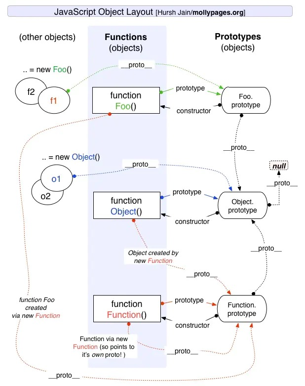

## JS的组成
---
- `核心（ECMAScript）`，提供核心语言功能
- `文档对象模型（DOM）`，提供访问和操作网页的方法和接口
- `浏览器对象模型（BOM）`，提供与浏览器交互的方法和接口

### ECMAScript
> ECMAScript 就是对实现该标准规定的各个方面内容的语言的描述

包括
- `语法`
- `类型`
- `语句`
- `关键字`
- `保留字`
- `操作符`
- `对象`

### DOM
> DOM是针对XML但经过扩展用于HTML的应用程序编程接口

- `核心 DOM` - 针对任何结构化文档的标准模型
- `XML DOM` - 针对 XML 文档的标准模型
- `HTML DOM` - 针对 HTML 文档的标准模型

### BOM
> 支持可以访问和操作浏览器窗口的浏览器对象模型,核心是window
- `location`
- `navigator`
- `screen`
- `history`
- `document`

## 数据类型
---
- `Undefined`
- `Null`
- `Boolean`
- `Number`
- `String`
- `Object`
- `Symbol`

!>基本类型是按值来访问的  
引用类型的值是保存在内存中的对象，JS不能直接操作对象的内存空间，实际上是在操作对象的引用,但是如果是为对象添加属性实际上是在操作对象

基本类型存放在`栈内存`中，引用类型存放在`堆内存`中  

栈是一种数据结构（`先进后出`） 类似`push()`,`pop()`  
队列数据结构是 （`先进先出`） 类似`unshift()`,`shift()`

从一个变量向另一个变量复制基本类型的值，会在变量对象上创建一个新值，然后把该值复制到为新变量分配的位置上  
从一个变量向另一个变量复制引用类型的值时，会将存储在变量对象中的`指针`复制一份放到新变量分配的空间中，指针指向存储在堆中的另一个对象  
函数的参数都是按值来传递的
```
//typeof 可以检测变量的数据类型
- undefined
- boolean
- string
- number
- object
- function

// instanceof 检测是什么类型的对象 返回boolean 值
person instanceof Object

```
>object instanceof constructor

`instanceof` 运算符用于检测构造函数的 `prototype` 属性是否出现在某个实例对象的原型链上。  


!> null表示一个空对象指针，typeof null 为object

## 执行上下文/作用域链/原型链/闭包
---

### 执行上下文
执行上下文：执行 `JavaScript` 代码的环境的抽象概念。（执行代码时创建的）`JavaScript`代码都是在执行上下文中运行的

包括
- 全局执行上下文
- 函数执行上下文
- Eval函数执行上下文

### 执行栈
执行栈是一个存储函数调用的栈结构，遵循`先进后出`的原则。  
当我们使用递归的时候，因为栈可存放的函数是有限制的，一旦存放了过多的函数且没有得到释放的话，就会出现爆栈的问题

### 变量提升 
当前执行上下文下，所有代码执行之前， `var`会提前声明，`function`会提前声明和定义。函数声明优先于变量提升

### 作用域
作用域规定了如何查找变量，也就是确定当前执行代码对变量的访问权限。

### 作用域链
当访问一个变量时,会先从当前上下文的变量对象中查找，如果没有找到，就会从父级(词法层面上的父级)执行上下文的变量对象中查找，一直找到全局上下文的变量
对象，也就是全局对象。这样由多个执行上下文的变量对象构成的链表就叫做作用域链。

### 原型
Js每个对象都有个`__proto__`属性,这个属性指向了原型，原型也是一个对象
原型的`constructor`指向它的构造函数,`constructor`的属性`prototype` 又指向原型,但是并不是所有函数都具有这个属性，`Function.prototype.bind()` 就没有这个属性。




### 原型链
每个实例对象（ `object` ）都有一个私有属性（称之为 `__proto__` ）指向它的构造函数的原型对象（`prototype` ）。该原型对象也有一个自己的原型对象
( `__proto__` ) ，层层向上直到一个对象的原型对象为 `null`。这种关系被称为原型链

### 闭包
闭包是一个可以访问外部作用域的内部函数

!>闭包只取得包含函数中任何变量的最后一个值，闭包保存的是整个变量对象，而不是某个特点的变量


匿名函数的执行环境有全局性，`this`通常执行`window`

### this
函数执行的环境对象  
`caller`保存着调用当前函数的函数的引用（如果是在全局作用域中调用当前函数，它的值为`null`)

this 指向问题：  


## 深浅拷贝

### 浅拷贝
```js
let a = {
  age: 1
}
let b = Object.assign({}, a)
a.age = 2
console.log(b.age) // 1
```
```js
let a = {
  age: 1
}
let b = { ...a }
a.age = 2
console.log(b.age) // 1
```
### 深拷贝
```js
const deepClone = obj => {
  if (obj === null) return null;
  let clone = Object.assign({}, obj);
  Object.keys(clone).forEach(
    key =>
      (clone[key] =
        typeof obj[key] === 'object' ? deepClone(obj[key]) : obj[key])
  );
  if (Array.isArray(obj)) {
    clone.length = obj.length;
    return Array.from(clone);
  }
  return clone;
};
```
```js
let a = {
  age: 1,
  jobs: {
    first: 'FE'
  }
}
let b = JSON.parse(JSON.stringify(a))
a.jobs.first = 'native'
console.log(b.jobs.first) // FE
```
缺点：
- 会忽略 `undefined`
- 会忽略 `symbol`
- 不能序列化函数
- 不能解决循环引用的对象

推荐使用lodash 的深拷贝函数

赋值运算符 `=`和数组或对象提供的拷贝方法都是`首层浅拷贝`
`JSON.stringfy` 是深拷贝但对对象有要求

## 事件循环

执行栈放入函数时，看是同步代码还是异步代码，异步代码会被挂起并在需要执行的时候加入Task队列中，一旦执行栈为空，`event Loop`就会从`task`队列拿出需要
执行的代码并放入执行栈中执行，task队列又分为微任务`（microtask）` 和 宏任务`（macrotask)`在 ES6 规范中，`microtask` 称为 `jobs`，`macrotask` 称为 `task`。

所以 Event Loop 执行顺序如下所示：

- 首先执行同步代码，这属于宏任务
- 当执行完所有同步代码后，执行栈为空，查询是否有异步代码需要执行
- 执行所有微任务
- 当执行完所有微任务后，如有必要会渲染页面
- 然后开始下一轮 Event Loop，执行宏任务中的异步代码，也就是 setTimeout 中的回调函数

微任务包括： `process.nextTick` ，`promise` ，`MutationObserver`，其中 `process.nextTick` 为Node独有  
宏任务包括： `script` ， `setTimeout` ，`setInterval` ，`setImmediate` ，`I/O` ，`UI rendering`。


## 数组的迭代，归并
- `every()`
- `filter()`
- `forEach()`
- `map()`
- `some()`
- `reduce()`
- `reduceRight()`

## arguments
是一个类数组对象（并不是一个Array的实例），因为可以用方括号访问它的每一个元素  
主要用途是保存函数的参数  
`callee`指向拥有arguments对象的函数

## 垃圾回收
原理：找出那些不再继续使用的变量，然后释放其占用的内存
- 标记清除
- 引用计数

!> 将变量设置为null可以切断变量与它之前引用的值之间的连接

## 属性类型
- 数据属性
 * `[[Configurable]]`: 能否通过delete删除属性从而重新定义属性，能否修改属性的特性，能否把属性修改为访问器属性 默认true
 * `[[Enumerable]]`: 能否通过for-in循环返回属性 默认true
 * `[[Writable]]`: 能否修改属性的值 默认true
 * `[[Value]]`: 包含这个属性的数据值 默认undefined
 
  >要修改属性默认的特性，必须用Object.defineProperty()，接收三个参数：属性所在的对象，属性的名字和一个描述符对象，
  Object.defineProperty()方法创建一个新属性时，如果不指定，`configurable`,`enumerable`,`writable` 默认`false`
- 访问器属性
 * `[[Configurable]]`: 能否通过delete删除属性从而重新定义属性，能否修改属性的特性，能否把属性修改为访问器属性 默认true
 * `[[Enumerable]]`: 能否通过for-in循环返回属性 默认true
 * `[[Get]]`: 在读取属性时调用的函数 默认undefined
 * `[[Set]]`: 在写入属性时调用的函数 默认undefined
 
`Object.getOwnPropertyDescriptor()` 可以取得给定属性的描述符

## 创建对象 

### 工厂模式

```js
 function createPerson(name,age,job) {
    var o = new Object();
    o.name = name;
    o.age = age;
    o.job = job;
    o.sayName = function () {
      alert(this.name)
    };
    return o;
  }
  var person1 = createPerson('Nicholas',29,'Soft Engineer');
  var person2 = createPerson('Greg',27,'Doctor');
```
解决了创建多个相似对象的问题，但没有解决对象识别的问题（即怎样知道一个对象的类型）

### 构造函数模式
```js
 function Person(name,age,job) {
   this.name = name;
   this.age = age;
   this.job = job;
   this.sayName = function () {
     alert(this.name)
   }
 }
 var person1 = new Person('Nicholas',29,'Soft Engineer');
 var person2 = new Person('Greg',27,'Doctor');
 
 // person1.constructor == Person //true
 // person2.constructor == Person //true
 // person1.instanceof Object //true
 // person1.instanceof Person //true
 // person2.instanceof Object //true
 // person2.instanceof Person //true
 // person1.sayName == person2.sayName //false
```
和工厂模式的不同点：  
- 没有显式地创建对象
- 直接将属性和方法赋值给了`this`对象
- 没有`return`语句
- `Person P` 是大写

>调用构造函数的步骤 new Object
1. 创建一个新对象
2. 将构造函数的作用域赋给新对象（this指向这个新对象）
3. 执行构造函数中的代码（为这个新对象添加属性）
4. 返回新对象

任何函数通过`new`操作符调用就可以作为构造函数  
优点：  
- 自定义构造函数可以将它的实例标识为一种特定的类型（胜过工厂模式的地方）  

缺点：   
- 每个方法都要在每个实例上重新创建一遍（不同实例上的同名函数是不相等的）

```js
  function Person(name, age, job) {
    this.name = name;
    this.age = age;
    this.job = job;
    this.sayName = sayName;
  }

  function sayName() {
    alert(this.name)
  }

  var person1 = new Person('Nicholas', 29, 'Soft Engineer');
  var person2 = new Person('Greg', 27, 'Doctor');
  // person1.sayName == person2.sayName //true
```
缺点：
- 全局作用域中定义的函数实际上只能被某个对象调用，这让全局作用域有点名不副实
- 如果需要多个方法就要定义多个全局函数

### 原型模式
```js
 function Person() {

  }

  Person.prototype.name = 'Nicholas';
  Person.prototype.age = 29;
  Person.prototype.job = 'Soft Engineer';
  Person.prototype.sayName = function () {
    alert(this.name)
  };

  var person1 = new Person();
  person1.sayName();
  var person2 = new Person();
  person2.sayName();
  alert(person1.sayName == person2.sayName)
  
  // Person.prototype.isPrototypeOf(person1) // true  
  // Person.prototype.isPrototypeOf(person2) // true
  // Object.getPrototypeOf(person1) == Person.prototype // true
```
`isPrototypeOf()` 方法用于测试一个对象是否存在于另一个对象的原型链上。  
`Object.getPrototypeOf()` 方法返回指定对象的原型  
`hasOwnProperty()`检测一个属性是存在于实例中还是存在原型中


优点：
可以让所有对象实例共享它所包含的属性和方法

缺点：改变属性会造成相互影响

`Person.prototype` 指向原型对象  
`Person.prototype.constructor` 指向Person

调用构造函数时会为实例添加一个指向最初原型的指针，而把原型修改为另一个对象就等于切断了构造函数与最初原型之间的联系  

!>实例中的指针仅指向原型，而不指向构造函数
```js
var friend = new Person();
Person.prototype = {
  constructor:Person,
  name: 'Nicholas',
  age: 29,
  job: 'Software Engineer',
  sayName: function () {
    alert(this.name)
  }
}
friend.sayName(); // error
```

### 组合使用构造函数模式和原型模式
最广泛，认同度最高的一种创建自定义类型的方法
```js
function Person(name, age, job) {
    this.name = name;
    this.age = age;
    this.job = job;
    this.friends = ['Shelby','Court']
  }
  Person.prototype = {
    constructor: Person,
    sayName: function () {
      alert(this.name)
    }
  }
  var person1 = new Person('Nicholas', 29, 'Soft Engineer');
  var person2 = new Person('Greg', 27, 'Doctor');
  person1.friends.push('van');
  alert(person1.friends); // Shelby,Count,Van
  alert(person2.friends); // Shelby,Count
  alert(person1.friends === person2.friends); // false
  alert(person1.sayName === person2.sayName); // true
```

### 动态原型模式
```js
  function Person(name, age, job) {
    this.name = name;
    this.age = age;
    this.job = job;
    if (typeof this.sayName != 'function') {
      Person.prototype.sayName = function () {
        alert(this.name)
      }
    }
  }

  var friend = new Person('Nicholas', 29, 'Software Engineer')
  friend.sayName()
```

### 寄生构造函数模式
```js
 function Person(name,age,job) {
    var o = new Object();
    o.name = name;
    o.age = age;
    o.job = job;
    o.sayName = function () {
      alert(this.name)
    };
    return o;
  }
  var friend = new Person('Nicholas',29,'Soft Engineer');
  friend.sayName()
```
除了使用new包装函数外，这个模式跟工厂模式一模一样  
缺点：构造函数返回的对象与构造函数外部创建的对象没有什么不同，因此不能依赖instanceof 确定对象类型

### 稳妥构造函数模式
稳妥对象：没有公共属性，其它方法也不引用this对象
```js
  function Person(name,age,job) {
    var o = new Object();
    o.sayName = function () {
      alert(name)
    };
    return o;
  }
  var friend = Person('Nicholas',29,'Soft Engineer');
  friend.sayName()
```
类似寄生构造函数模式
特点：
- 新创建对象的实例方法不引用this
- 不使用new操作符调用构造函数

## 继承

### 原型链继承
```js
function SuperType() {
  this.property = true
}
SuperType.prototype.getSuperValue = function () {
  return this.property
}
function SubType() {
  this.subproperty = false
}
SubType.prototype = new SuperType();
SubType.prototype.getSubValue = function () {
  return this.subproperty;
}
var instance = new SuperType();
alert(instance.getSuperValue())
```
!>通过原型链实现继承时，不能使用对象字面量创建原型方法。会重写原型链

缺点：
- 包含引用类型值的原型
- 在创建子类型的实例时，不能向超类型的构造函数中传递参数

### 借用构造函数
```js
function SuperType() {
  this.colors = ['red','blue','green']
}
function SubType() {
  SuperType.call(this)
}
var instance1 = new SubType();
instance1.colors.push('black');
alert(instance1.colors); // red,blue,green,black

var instance2 = new SubType();
alert(instance2.colors); // red,blue,green
```
缺点：函数无法复用，方法都在构造函数中定义

### 组合继承
```js
function SuperType(name) {
  this.name = name;
  this.colors = ['red','blue','green']
}
SuperType.prototype.sayName = function () {
  alert(this.name)
}
function SubType(name,age) {
  SuperType.call(this,name) // 第2次调用SuperType
  this.age = age
}
SubType.prototype = new SuperType(); // 第1次调用SuperType
SubType.prototype.constructor = SubType;
SubType.prototype.sayAge = function () {
  alert(this.age)
}

var instance1 = new SubType('Nicholas',29);
instance1.colors.push('black');
alert(instance1.colors); // red,blue,green,black
instance1.sayName(); // Nicholas
instance1.sayAge(); // 29

var instance2 = new SubType('Grep',27);
instance1.colors.push('black');
alert(instance2.colors); // red,blue,green
instance2.sayName(); // Grep
instance2.sayAge(); // 27
```
缺点：调用2次超类型构造函数

### 原型式继承
```js
function objec(o) {
  function F() {}
  F.prototype = o;
  return new F()
}
```
Object.create()规范了原型式继承

### 寄生式继承
```js
function createAnother(original) {
  var clone = object(original);
  clone.sayHi = function () {
    alert('hi')
  };
  return clone
}

var person = {
  name:'Nicholas',
  friends: ['Shelby','Court','Van']
}
var anotherPerson = createAnother(person);
anotherPerson.sayHi()
```

### 寄生组合继承
最理想的继承范式
```js
function inheritPrototype(subType,superType) {
  var prototype = object(superType.prototype);
  prototype.constructor = subType;
  subType.prototype = prototype
}
function SuperType(name) {
  this.name = name;
  this.colors = ['red','blue','green']
}
SuperType.prototype.sayName = function () {
  alert(this.name)
};
function SubType(name,age) {
  SuperType.call(this,name);
  this.age = age
}
inheritPrototype(SuperType,SuperType); // 去掉了前面的为子类型赋值语句
SuperType.prototype.sayAge = function () {
  alert(this.age)
}
```
优点：只调用了一次SuperType构造函数，避免了在SubType.prototype上创建不必要、多余的属性

## 进程和线程
进程描述了 `CPU` 在运行指令及加载和保存上下文所需的时间，放在应用上来说就代表了一个程序。  
线程是进程中的更小单位，描述了执行一段指令所需的时间。

## JS引擎
`JavaScript` 引擎说起来最流行的当然是谷歌的 `V8` 引擎了  
组成部分： 
- 内存堆：这是内存分配发生的地方 （存储引用类型值的空间）
- 调用栈：这是你的代码执行时的地方 （存储基本类型值和指定环境）

## 跨域
如果`协议`、`域名`或者`端口`有一个不同就是跨域

JSONP 的原理很简单，就是利用 `<script>` 标签没有跨域限制的漏洞。通过` <script>` 标签指向一个需要访问的地址并提供一个回调函数来接收数据当需要通讯时。
只限于 get 请求。


## 存储

|特性|cookie|localStorage|sessionStorage|indexDB|
|:---|:---:|:---:|:---:|:---:|
|数据生命周期|一般由服务器生成，可以设置过期时间	|除非被清理，否则一直存在|页面关闭就清理|除非被清理，否则一直存在|
|数据存储大小|4K|5M|5M|无限|
|与服务端通信|每次都会携带在 header 中，对于请求性能影响	|不参与|不参与|不参与|

## 浏览器缓存
- `Service Worker`
- `Memory Cache`
- `Disk Cache`
- `Push Cache`
- `网络请求`

## 浏览器渲染原理
- 浏览器接收到 `HTML` 文件并转换为 `DOM` 树（`字节数据`->`字符串`->`Token`->`Node`->`DOM`）
- 将 `CSS` 文件转换为 `CSSOM` 树 （`字节数据`->`字符串`->`Token`->`Node`->`CSSOM`）
- 生成渲染树(当我们生成 `DOM` 树和 `CSSOM` 树以后，就需要将这两棵树组合为渲染树)
- 根据渲染树来布局，以计算每个节点的几何信息
- 将各个节点绘制到屏幕上
