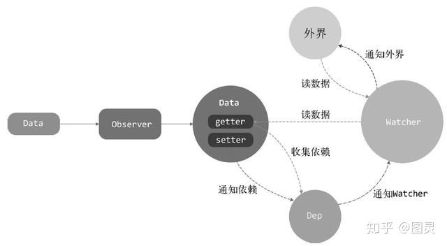

## 什么是vue
`Vue`是一套用于构建用户界面的渐进式框架。  

如果你已经有一个现成的服务端应用，也就是非单页面应用，可以将Vue.js作为该应用的一部分嵌入其中，带来更加丰富的交互体验  

`渐进式框架`就是把框架分层  
分层就是说可以只用最核心的视图层渲染功能来快速开发一些需求，也可以使用一整套全家桶来开发大型应用  

最核心的部分是视图层渲染，往外是组件机制，再加上路由机制，再加入状态管理，最外层是构建工具


## 变化侦测
变化侦测是响应式系统的核心，作用是侦测数据的变化。当数据变化时，会通知视图进行相应的更新

一个状态所绑定的依赖不再是具体的DOM节点，而是一个组件。状态变化后，会通知到组件，组件内部再使用虚拟DOM进行对比，重新渲染

利用`object.defineProperty` 侦测变化
```js
function defineReactive(data,key,val) {
  object.defineProperty(data,key,{
    enumerable: true,
    configurable: true,
    get: function () {
      return val
    },
    set: function (newVal) {
      if (val === newVal){
        return
      }
      val = newVal
    }
  })
}
```
### 如何收集依赖
在`getter`中收集依赖，在`setter`中触发依赖
```js
function defineReactive(data,key,val) {
  let dep = []; // 存储被收集的依赖，依赖是个函数
  object.defineProperty(data,key,{
    enumerable: true,
    configurable: true,
    get: function () {
      dep.push(window.target)
      return val
    },
    set: function (newVal) {
      if (val === newVal){
        return
      }
      for (let i = 0;i<dep.length;i++){
        dep[i](newVal,val) // 循环触发依赖
      }
      val = newVal
    }
  })
}
```
封装Dep类解耦
```js
export default class Dep{
  constructor(){
    this.subs = []
  }

  addSub(sub){
    this.subs.push(sub)
  }

  removeSub(sub){
    remove(this.subs,sub)
  }

  depend(){
    if (window.target){
      this.addSub(window.target)
    }
  }

  notify(){
    const subs = this.subs.slice()
    for (let i = 0,l=subs.length;i<l;i++){
      subs[i].update()
    }
  }
}

function remove(arr,item) {
  if (arr.length){
    const index = arr.indexof(item)
    if (index > -1){
      return arr.splice(index,1)
    }
  }
}

function defineReactive(data,key,val) {
  let dep = new Dep(); // 存储被收集的依赖
  object.defineProperty(data,key,{
    enumerable: true,
    configurable: true,
    get: function () {
      dep.depend()
      return val
    },
    set: function (newVal) {
      if (val === newVal){
        return
      }
      val = newVal
      dep.notify()
    }
  })
}
```

### watcher
---
我们收集的依赖是`window.target`其实就是`Watcher`

原理：先把自己设置到全局唯一的指定位置，然后读取数据，触发这个数据的`getter`，接着`getter`读取当前正在读取数据的`Watcher`，并把这个`Watcher`收集到
Dep中

`Watcher`是一个中介的角色，数据发送变化时通知它，然后它再通知其它地方
```js
// keypath  当data.a.b.c 属性发生变化时，触发第二个参数中的函数
vm.$watch('a.b.c', function (newVal, oldVal) {
  // 做点什么
})
```
如何实现
```js
export default class Watcher{
  constructor (vm,expOrFn,cb){
    this.vm = vm
    // 执行this.getter(),就可以读取data.a.b.c的内容
    this.getter = parsePath(expOrFn)
    this.cb = cb
    this.value = this.get()
  }
  get(){
    window.target = this
    let value = this.getter.call(this.vm,this.vm)
    window.target = undefined
    return value
  }

  update(){
    const oldValue = this.value
    this.value = this.get()
    this.cb.call(this.vm,this.value,oldValue)
  }
}
```

```js
const bailRe = /[^\w.$]/;

export function parsePath(path) {
  if (bailRe.test(path)) {
    return
  }
  const segments = path.split('.');
  return function (obj) {
    for (let i = 0; i < segments.length; i++) {
      if (!obj) return
      obj = obj[segments[i]]
    }
    return obj
  }
}
```

### 递归侦测所有key
```js
/**
 * Observer类会附加到每一个被侦测的object上
 * 一旦被附加上，Observer会将object的所有属性转换为getter/setter形式
 * 来收集属性的依赖，并且当属性发生变化时会通知这些依赖
 */
export class Observer{
  constructor(value){
    this.value = value
    if (!Array.isArray(value)){
      this.walk(value)
    } 
  }

  /**
   * walk 会将每一个属性都转换为getter/setter形式来侦测变化
   * 这个方法只有在数据类型为object时被调用
   */
  walk(obj){
    const keys = Object.keys(obj)
    for(let i=0;i<keys.length;i++){
      defineReactive(obj,keys[i],obj[keys[i]])
    }
  }
}

function defineReactive(data,key,val) {
  if (typeof val === 'object'){
    new Observer(val)
  }
  let dep = new Dep(); // 存储被收集的依赖
  object.defineProperty(data,key,{
    enumerable: true,
    configurable: true,
    get: function () {
      dep.depend()
      return val
    },
    set: function (newVal) {
      if (val === newVal){
        return
      }
      val = newVal
      dep.notify()
    }
  })
}
```

### 关于object的问题
`getter`/`setter`只能追踪一个数据是否修改，无法追踪新增属性和删除属性  
为obj新增属性，删除属性，vue无法检测到变化，所有不会向依赖发送通知 要用到 `vm.$set`，`vm.$delete`

### data,observer,dep,watcher关系  


## Array 的变化侦测
因为可以通过`Array`原型的方法改变数组内容，所以`Object`的`getter/setter`的实现方式行不通

用一个拦截器覆盖掉Array.prototype。每当使用Array原型上的方法操作数组时，其实执行的都是拦截器中提供的方法，这样我们就可以追踪Array的变化
### 拦截器
```js
const arrayProto = Array.prototype;
export const arrayMethods = Object.create(arrayProto);
['push', 'pop', 'shift', 'unshift', 'splice', 'sort', 'reverse'].forEach(function (method) {
  const original = arrayProto[method];
  Object.defineProperty(arrayMethods, method, {
    value: function mutator(...args) {
      return original.apply(this, args)
    },
    enumerable: true,
    writable: true,
    configurable: true
  })
})


export class Observer {
  constructor(value) {
    this.value = value
    if (Array.isArray(value)) {
      value.__proto__ = arrayMethods // 只会覆盖掉需要转换响应式的数据原型
    } else {
      this.walk(value)
    }
  }
}
```

如果没有__proto__ 直接将arrayMethods身上的方法设置到被侦测的数组上
```js
import {arrayMethods}from './array'

const  hasProto = '__proto__' in {};
const arrayKeys = Object.getOwnPropertyNames(arrayMethods)

export class Observer {
  constructor(value) {
    this.value = value
    if (Array.isArray(value)) {
      const augment = hasProto ? protoAument : copyAument
      augment(value,arrayMethods,arraykeys)
    } else {
      this.walk(value)
    }
  }
  ......
}

function protoAugment(target,src,keys) {
  target.__proto__ = src
}
function copyAument(target,src,keys) {
  for (let i =0;l=keys.length;i<l;i++){
    const key = keys[i]
    def(target,key,src[key])
  }
}
```
Array 在getter中收集依赖，在拦截器中触发依赖
```js

export class Observer {
  constructor(value) {
    this.value = value;
    this.dep = new dep()
    if (Array.isArray(value)) {
      const augment = hasProto ? protoAument : copyAument
      augment(value,arrayMethods,arraykeys)
    } else {
      this.walk(value)
    }
  }
  ......
}
```
### 收集依赖
```js
  function defineReactive(data,key,val) {
    let childOb = observe(val)
    let dep = new Dep(); // 存储被收集的依赖
    object.defineProperty(data,key,{
      enumerable: true,
      configurable: true,
      get: function () {
        dep.depend()
        if (childOb){
          childOb.dep.depend()
        } 
        return val
      },
      set: function (newVal) {
        if (val === newVal){
          return
        }
        dep.notify()
        val = newVal
      }
    })
  }
    /**
     * 尝试为value创建一个Observe实例，
     * 如果创建成功，直接返回新建的Observe实例
     * 如果value已经存在一个Observe实例，则直接返回它
     */
  export function observe(value,asRootData) {
    if(!isObject(value)){
      return
    }
    let ob
    if (hasOwn(value,'__ob__') && value.__ob__ instanceof Observe){
      ob = value.__ob__
    } else{
      ob = new Observe(value)
    }
    return ob
  }
```

### 拦截器中获取Observe
```js
function def(obj,key,val,enumerable) {
    Object.defineProperty(obj,key,{
      value:val,
      enumerable: !!enumerable,
      writable:true,
      configurable:true
    })
  }
  
export class Observe{
  constructor(value){
    this.val = value
    this.dep = new Dep()
    def(value,'__ob__',this) // 拿到Observe实例和标记是否被Observe转换成响应式数据
    if (Array.isArray(value)){
      const augment = hasProto
      ? protoAugment
      : copyAugment
      augment(value,arrayMethods,arraykeys)
    } else{
      this.walk(vaule)
    }
  }
  ......
}
```

### 向数组依赖发送通知
```js
  ['push', 'pop', 'shift', 'unshift', 'splice', 'sort', 'reverse'].forEach(function (method) {
    const original = arrayProto[method];
    def(arrayMethods,method,function mutator(...args) {
      const result = original.apply(this,args)
      const ob = this.__ob__
      ob.dep.notify() // 向依赖发送消息
      return result
    })
  })
```

### 侦测数组中的元素变化
```js
export class Observe{
  constructor(value) {
   this.value = value
    def(value,'__ob__',this)
    if (Array.isArray(value)){
      this.observeArray(value)
    } else {
      this.walk(value)
    }
  }

  observeArray(items){
    for (let i=0,l=items.length;i<l;i++){
      observe(items[i])
    } 
  }
  ......
}
```
### 侦测新增数组元素的变化
```js
['push', 'pop', 'shift', 'unshift', 'splice', 'sort', 'reverse'].forEach(function (method) {
  const original = arrayProto[method];
  def(arrayMethods,method,function mutator(...args) {
    const result = original.apply(this,args)
    const ob = this.__ob__
    let inserted
    switch (method) {
      case 'push':
      case 'unshift':
        inserted = args
        break
      case 'splice':
        inserted = args.slice(2)
        break
    }
    if (inserted) ob.observeArray(inserted) // 检测新增元素变化
    ob.dep.notify() // 向依赖发送消息
    return result
  })
})
```
### 总结
Array是通过创建拦截器去覆盖数组原型来追踪变化，在getter中收集依赖，依赖是保存在Observer上，通过__ob__可以访问

## vm.$watch
```js
Vue.prototype.$watch = function (expOrFn,cb,options) {
  const vm = this
  options = options || {}
  const watcher = new Watcher(vm,expOrFn,cb,options)
  if (options.immediate){
    cb.call(vm,watcher.value)
  }
  return function unwatchFn() {
    watcher.teardown() // 取消观察数据
  }
}

export default class Watcher{
  constructor(vm,expOrFn,cb){
    this.vm = vm
    if(typeof expOrFn === 'function'){
      this.getter = expOrFn
    }else{
      this.getter = parsePath(expOrFn)
    }
    this.cb = cb
    this.value = this.get()
  }
  ......
}
```
## vm.$set
```js
export function set(target,key,value) {
  if (Array.isArray(target) && isValidArrayIndex(key)){
    target.length = Math.max(target.length,key)
    target.splice(key,1,value)
    return value
  }

  // key已经存在target
  if (key in target && !(key in Object.prototype)){
    target[key] = val
    return val
  }
  
  
  const ob = target.__ob__
  if (target._isVue || (ob && ob.vmCount)){
    process.env.NODE_ENV !== 'production' && warn(
      'Avoid adding reactive properties to a Vue instance or its root $data' + 
      'at runtime - declare it upfront in the data option'
    )
    return val
  } 
  if (!ob){
    target[key] = val
    return  val
  } 
  defineReactive(ob.value,key,val)
  ob.dep.notify()
  return val
}
```

## vm.$delete
```js
export function del(target,key) {
  if (Array.isArray(target) && isValidArrayIndex(key)){
    target.splice(key,1)
    return
  }
  const ob = target.__ob__
  if (target._isVue || (ob && ob.vmCount)){
    process.env.NODE_ENV !== 'production' && warn(
      'Avoid adding reactive properties to a Vue instance or its root $data' +
      '- just set it to null'
    )
    return
  }
  if (!hasOwn (target,key)){
    return
  }
  
  if (!ob){
    return;
  }
  delete target[key]
  ob.dep.notify()
}
```

## 虚拟DOM
是一个用于表示真实 DOM 结构和属性的 JavaScript 对象

### 虚拟DOM是怎么更新DOM的
通过状态生成一个虚拟节点树，然后使用虚拟节点树进行渲染。在渲染之前，会使用新生成的虚拟节点数和上一次生成的虚拟节点数进行对比，只渲染不同的部分。  
`虚拟节点树`：由组件树建立起来的整个虚拟节点（vnode）树

### 为什么要引入虚拟DOM
`Vue1.0` 是通过更细粒度的绑定来更新视图。因为粒度太细，每一个绑定都有一个对应的`watcher`来观察状态的变化，这样会有一些内存开销以及一些依赖追踪的开销

`Vue2.0` 引入虚拟DOM。组件级别是一个`watcher`实例。当这个状态发生变化时，只通知到组件，然后组件内部通过虚拟DOM去进行对比和渲染

`Vue.js` 通过模版来描述状态与视图之间的映射关系，所有它会先将模版编译成渲染函数，然后执行渲染函数生成虚拟节点，最后使用虚拟节点更新视图

### 虚拟DOM作用
- 提供与真实DOM节点所对应的虚拟节点vnode
- 将虚拟节点vnode和旧虚拟节点oldVnode进行对比，然后更新视图

## 什么是VNode
是一个Javascript中的一个普通对象，是从VNode类实例化的对象。简单来说，vnode可以理解为节点描述对象，它描述了应该怎样去创建真实的DOM节点

### VNode的作用
每次渲染视图都是先创建vnode，然后使用它创建真实DOM插入页面中，将上次渲染视图的vnode缓存起来，并与当前新创建的vnode进行对比，只更新发生变化的节点

### VNode 类型
- 注释节点
- 文本节点
- 元素节点
- 组件节点
- 函数式组件
- 克隆节点
```js
// 注释节点
export const createEmptyVnode = text =>{
  const node = new VNode()
  node.text = text
  node.isComment = true
  return node
}
// 文本节点
export function createTextVNode(val) {
  return new VNode(undefined,undefined,undefined,String(val))
}
// 克隆节点
export function cloneVNode(vnode,deep) {
  const cloned = new VNode(
    vnode.tag,
    vnode.data,
    vnode.children,
    vnode.text,
    vnode.elm,
    vnode.context,
    vnode.componentOptions,
    vnode.asyncFactory,
  )
  cloned.ns = vnode.ns
  cloned.isStatic = vnode.isStatic
  cloned.key = vnode.key
  cloned.isComment = vnode.isComment
  cloned.isCloned = true
  if (deep && vnode.children){
    cloned.children = cloneVNode(vnode.children)
  }
  return cloned
}
```

## patch
虚拟DOM最核心的部分，它可以将vnode渲染成真实的DOM

path的过程：
- 创建新增节点
- 删除已经废弃的节点
- 修改需要更新的节点

当`oldVnode`不存在时，直接使用vnode渲染视图  
当`oldVnode`和`vnode`都存在但并不是同一个节点时，使用vnode创建的DOM元素替换旧的DOM元素  
当`oldVnode`和`vnode`是同一个节点时，使用更详细的对比操作对真实的DOM节点进行更新

### 新增节点
- 当oldVnode不存在而vnode存在时，需要使用vnode生成真实的DOM元素并将其插入到视图当中
- 当vnode和oldVnode完全不是同一个节点时,需要使用vnode生成真实的DOM元素并将其插入到视图当中

### 删除节点
- 当一个节点只在oldVnode中存在时，需要从DOM中删除
- 当oldVnode和vnode完全不是同一个节点时,在DOM中需要使用vnode创建的新节点替换oldVnode所对应的旧节点

### 更新节点
- 新旧两个节点是用同一个节点，使用更详细的对比操作对真实DOM节点进行更新

### 创建节点
只有`元素类型`，`注释类型`，`文本类型` 的类型节点会被创建并插入到DOM

## 模板编译
主要目标是生成渲染函数。渲染函数的作用是每次执行它，它就会使用当前最新状态生成一份新的`vnode`，然后使用这个`vnode`进行渲染

模版编译三部分：
- 将模板解析为AST （解析器）
- 遍历AST标记静态节点（优化器）
- 使用AST生成渲染函数 （代码生成器）

### 解析器
一个用JS对象描述的节点树就是AST
包括：
- HTML解析器
- 文本解析器
- 过滤器解析器

作用：通过模板得到AST（抽象语法树）

### 优化器

作用：在AST中找出静态子树并打上标记，好处：
- 每次重新渲染时，不需要为静态子树创建节点
- 在虚拟DOM中打补丁的过程可以跳过

步骤：
- 在AST中找出所有静态节点并打上标记
- 在AST中找出所有静态根节点并打上标记

## new vue 发生了什么
```js
//src/core/instance/index.js
function Vue (options) {
  if (process.env.NODE_ENV !== 'production' &&
    !(this instanceof Vue)
  ) {
    warn('Vue is a constructor and should be called with the `new` keyword')
  }
  this._init(options)
}

//src/core/instance/init.js

export function initMixin (Vue: Class<Component>) {
  Vue.prototype._init = function (options?: Object) {
    const vm: Component = this
    // a uid
    vm._uid = uid++

    let startTag, endTag
    /* istanbul ignore if */
    if (process.env.NODE_ENV !== 'production' && config.performance && mark) {
      startTag = `vue-perf-start:${vm._uid}`
      endTag = `vue-perf-end:${vm._uid}`
      mark(startTag)
    }

    // a flag to avoid this being observed
    vm._isVue = true
    // merge options
    if (options && options._isComponent) {
      // optimize internal component instantiation
      // since dynamic options merging is pretty slow, and none of the
      // internal component options needs special treatment.
      initInternalComponent(vm, options)
    } else {
      vm.$options = mergeOptions(
        resolveConstructorOptions(vm.constructor),
        options || {},
        vm
      )
    }
    /* istanbul ignore else */
    if (process.env.NODE_ENV !== 'production') {
      initProxy(vm)
    } else {
      vm._renderProxy = vm
    }
    // expose real self
    vm._self = vm
    initLifecycle(vm)
    initEvents(vm)
    initRender(vm)
    callHook(vm, 'beforeCreate')
    initInjections(vm) // resolve injections before data/props
    initState(vm)
    initProvide(vm) // resolve provide after data/props
    callHook(vm, 'created')

    /* istanbul ignore if */
    if (process.env.NODE_ENV !== 'production' && config.performance && mark) {
      vm._name = formatComponentName(vm, false)
      mark(endTag)
      measure(`vue ${vm._name} init`, startTag, endTag)
    }

    if (vm.$options.el) {
      vm.$mount(vm.$options.el)
    }
  }
}

```
`new Vue` 执行了`_init` 方法

Vue 初始化主要就干了几件事情，合并配置，初始化生命周期，初始化事件中心，初始化渲染，初始化 data、props、computed、watcher 等等。

执行this.xxx 其实是调用了proxy 进行了拦截调用 this._data.xxx 
