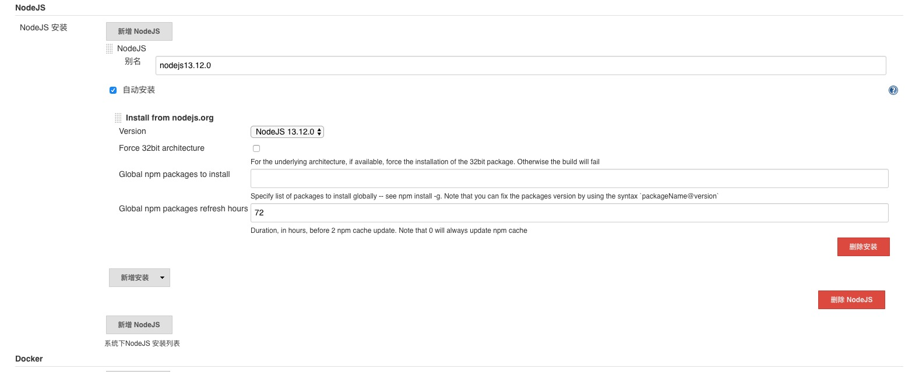
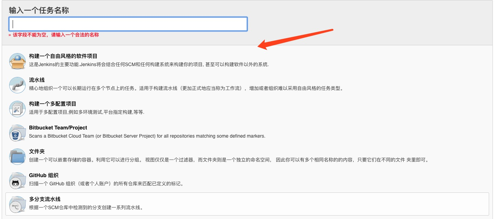
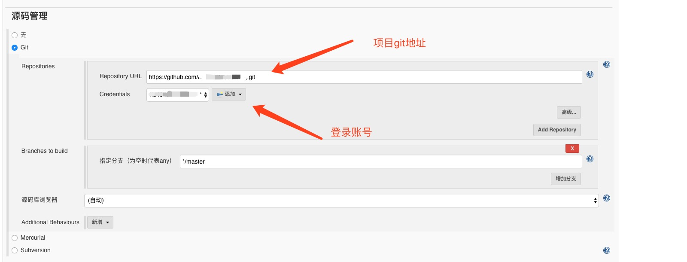
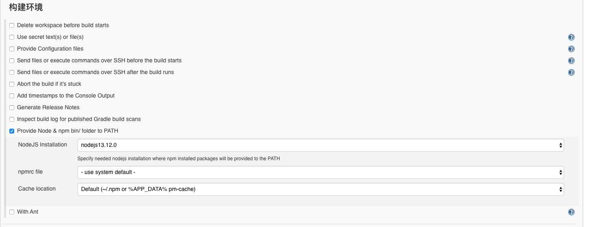
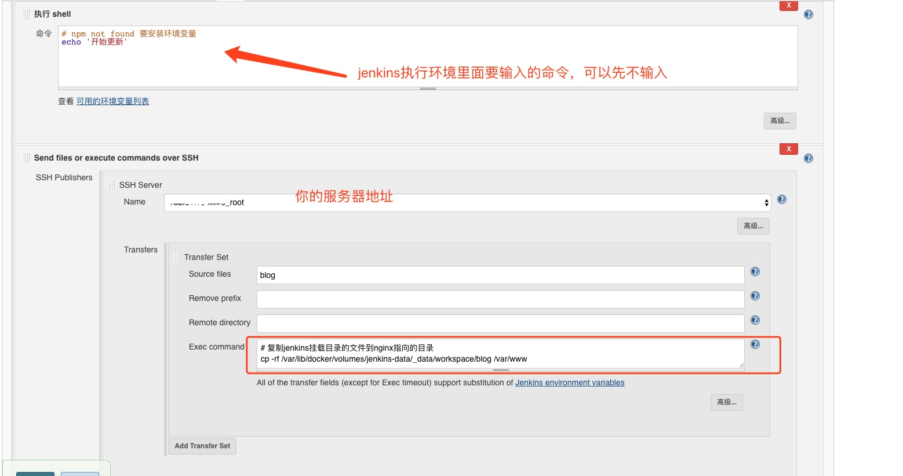

## 利用docsify搭建自己的博客
---
## 什么是docsify？
>`docsify` 是一个动态生成文档网站的工具。不同于 `GitBook`、`Hexo` 的地方是它不会生成将 `.md` 转成 `.html` 文件，所有转换工作都是在运行时进行。
>这将非常实用，如果只是需要快速的搭建一个小型的文档网站，或者不想因为生成的一堆 `.html` 文件“污染” commit 记录，只需要创建一个 `index.html` 就可以开始写文档而且直接部署在 `GitHub Pages`。

## 安装docsify
```bash
  npm i docsify-cli -g
```

## 初始化项目
```bash
  docsify init ./docs
```

## 本地预览网站
```bash
  docsify serve docs
```
这里可以自己写个脚本npm， `npm init` 创建 `package.json` 文件，加入
```bash
 "scripts": {
    "start": "docsify serve"
  }
```
下次直接使用 `npm run start` 就可以启动项目了

## jenkins 一键发布docsify
主要步骤：
1. 安装jenkins
2. 配置好jenkins,jenkins会自动clone你的git项目，如果是vue项目可以配置要npm脚本，在服务器上进入共享的目录下把文件复制到nginx指向的
index页面

### 下载nodejs插件
系统管理 -> 插件管理 -> 下载nodeJs Plugin 直接安装

### 全局配置nodeJs


### 新建一个自由风格的软件项目


### 配置项目





### 最后构建项目


## 参考地址：
1. docsify介绍：https://docsify.js.org/#/zh-cn/

