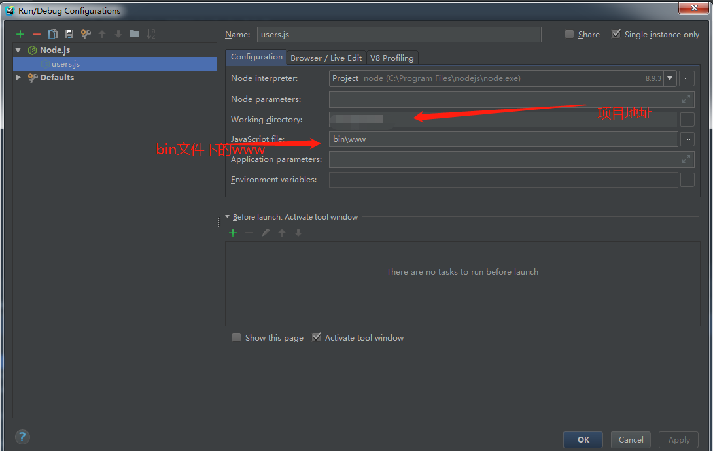
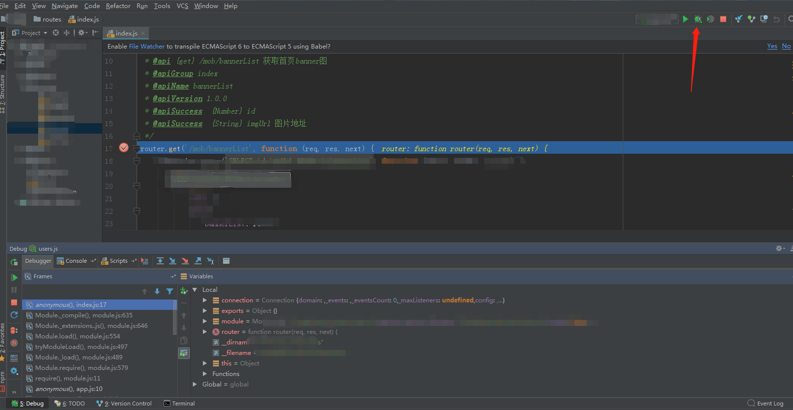

## WebStorm
---
>WebStorm 是jetbrains公司旗下一款JavaScript 开发工具。目前已经被广大中国JS开发者誉为“Web前端开发神器”、“最强大的HTML5编辑器”、“最智能的JavaScript IDE”等。与IntelliJ IDEA同源，继承了IntelliJ IDEA强大的JS部分的功能。

# 注册码
## 步骤
1. 打开 `C:\Windows\System32\drivers\etc` 的`host`文件，最后一行添加`0.0.0.0 account.jetbrains.com`
2. 打开 `http://idea.lanyus.com/` 获取注册码，将注册码粘贴于webstorm

或者 http://lookdiv.com/
或者 http://idea.medeming.com/jets/
## 问题
1. 出现 host 拒绝访问的提示：
解决：复制host文件到桌面并修改，再把修改好的文件覆盖到之前的文件路径

## 场景
前端vue项目，后端express项目

## 调试
1. 配置 菜单栏 -> Run - > Edit configuration

2. 在对应的接口打断点，调用接口时能进入该断点就成功了

